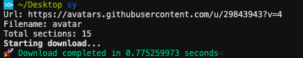

# Sy

Sy is a small, fast, concurrent download manager written in Go. It divides the input file into sections and concurrently downloads them.

## Usage

  
## Acknowledgements

 - [Range header documentation](https://developer.mozilla.org/en-US/docs/Web/HTTP/Headers/Range)

  
## Contributing

Contributions are always welcome!

See `contributing.md` for ways to get started.

Please adhere to this project's `code of conduct`.

  
## Authors

- [@yummyweb](https://www.github.com/yummyweb)

  
## License

[MIT](https://choosealicense.com/licenses/mit/)

  
